# Netflix News Database System - Project Report

---

## 1. Executive Summary

### 1.1 Business Scenario

Netflix, as a leading streaming platform, manages an extensive catalog of web series content along with complex relationships involving production houses, producers, contracts, broadcast schedules, and customer feedback. The Netflix News Database System was developed to provide a comprehensive web-based management solution for this ecosystem.

The system addresses the need for:
- **Content Management**: Organizing and tracking web series with details such as episodes, languages, genres, and viewer statistics
- **Business Operations**: Managing production house partnerships, producer relationships, and contractual agreements
- **Customer Engagement**: Handling user accounts, enabling feedback/review submissions, and tracking viewer preferences
- **Scheduling**: Coordinating broadcast schedules for content delivery

### 1.2 Solution Approach

The solution implements a three-tier architecture:

1. **Presentation Layer**: Modern, responsive web interface using HTML5, CSS3, and JavaScript with Netflix-inspired design aesthetics
2. **Application Layer**: Spring Boot RESTful API backend providing secure, scalable business logic processing
3. **Data Layer**: MySQL relational database with MyBatis ORM for efficient data persistence

Key design principles applied:
- **RESTful API Design**: Clean, resource-oriented endpoints for all CRUD operations
- **Role-Based Access Control**: Differentiated permissions for customers and employees
- **Security-First Approach**: JWT authentication, password encryption, SQL injection prevention
- **Responsive UI**: Mobile-friendly interface with intuitive navigation

### 1.3 Business Performance Benefits

The implemented system enhances business performance through:

| Benefit Area | Impact |
|--------------|--------|
| **Operational Efficiency** | Centralized management reduces data silos and manual processes |
| **Decision Making** | Real-time statistics and visualizations enable data-driven insights |
| **Customer Satisfaction** | Feedback system facilitates continuous improvement based on user input |
| **Contract Management** | Automated tracking of production agreements and financial terms |
| **Content Discovery** | Search and filtering capabilities improve content accessibility |

### 1.4 Logical Model Design

The database follows a normalized relational model with the following key entities:

**Core Entities:**
- `User` - System authentication and authorization
- `Account` - Customer profile information
- `Web Series` - Content catalog with metadata
- `Production House` - Content production companies
- `Producer` - Individual content creators
- `Contract` - Business agreements between Netflix and production houses
- `Schedule` - Broadcast timing information
- `Feedback` - Customer reviews and ratings
- `Country` - Geographic reference data

**Design Assumptions:**
1. Each user can have at most one customer account (1:1 relationship)
2. A web series can be associated with multiple countries (origin, dubbing, subtitles)
3. Contracts are established between web series and production houses with annual terms
4. Feedback ratings use a 1-5 star scale
5. Users are classified as either 'customer' or 'employee' roles
6. Production houses can employ multiple producers (M:N relationship)

---

## 2. Technology Stack

### 2.1 Software and Frameworks

| Component | Technology | Version | Purpose |
|-----------|------------|---------|---------|
| **Backend Framework** | Spring Boot | 2.6.13 | RESTful API development |
| **ORM Framework** | MyBatis | 2.2.2 | Database mapping and queries |
| **Security** | Spring Security | 5.6.x | Authentication and authorization |
| **Build Tool** | Maven | 3.8+ | Dependency management and build |
| **Frontend** | HTML5/CSS3/JavaScript | ES6+ | User interface |
| **Visualization** | ECharts | 5.4.3 | Data charts and graphs |

### 2.2 Programming Languages

| Language | Usage |
|----------|-------|
| **Java 8** | Backend business logic, REST controllers, services |
| **SQL** | Database queries, stored procedures |
| **JavaScript (ES6+)** | Frontend interactivity, API communication |
| **HTML5** | Page structure and semantics |
| **CSS3** | Styling and responsive design |

### 2.3 Database

| Attribute | Value |
|-----------|-------|
| **RDBMS** | MySQL 8.0 |
| **Connection Pool** | Druid |
| **Database Name** | netflix_news |
| **Character Set** | UTF-8 |
| **Collation** | utf8mb4_unicode_ci |

---

## 3. Data Definition Language (DDL)

```mysql
CREATE DATABASE IF NOT EXISTS netflix_news 
CHARACTER SET utf8mb4 
COLLATE utf8mb4_unicode_ci;

USE netflix_news;

SET NAMES utf8mb4;
SET FOREIGN_KEY_CHECKS = 0;

-- ----------------------------
-- Table structure for jqy_account
-- ----------------------------
DROP TABLE IF EXISTS `jqy_account`;
CREATE TABLE `jqy_account`  (
  `account_id` int NOT NULL AUTO_INCREMENT,
  `full_name` varchar(100) CHARACTER SET utf8mb4 COLLATE utf8mb4_unicode_ci NOT NULL,
  `full_address` varchar(255) CHARACTER SET utf8mb4 COLLATE utf8mb4_unicode_ci NOT NULL,
  `open_date` date NOT NULL,
  `monthly_service_charge` decimal(8, 2) NOT NULL,
  PRIMARY KEY (`account_id`) USING BTREE,
  CONSTRAINT `chk_account_address` CHECK (`full_address` <> _utf8mb4''),
  CONSTRAINT `chk_account_name` CHECK (`full_name` <> _utf8mb4''),
  CONSTRAINT `chk_monthly_charge` CHECK (`monthly_service_charge` >= 0)
) ENGINE = InnoDB AUTO_INCREMENT = 1 CHARACTER SET = utf8mb4 COLLATE = utf8mb4_unicode_ci ROW_FORMAT = Dynamic;

-- ----------------------------
-- Table structure for jqy_contract
-- ----------------------------
DROP TABLE IF EXISTS `jqy_contract`;
CREATE TABLE `jqy_contract`  (
  `contract_id` int NOT NULL AUTO_INCREMENT,
  `web_series_id` int NOT NULL,
  `production_house_id` int NOT NULL,
  `sign_date` date NOT NULL,
  `end_date` date NOT NULL,
  `per_episode_fee` decimal(10, 2) NOT NULL,
  PRIMARY KEY (`contract_id`) USING BTREE,
  INDEX `web_series_id`(`web_series_id` ASC) USING BTREE,
  INDEX `production_house_id`(`production_house_id` ASC) USING BTREE,
  CONSTRAINT `jqy_contract_ibfk_1` FOREIGN KEY (`web_series_id`) REFERENCES `jqy_web_series` (`web_series_id`) ON DELETE CASCADE ON UPDATE RESTRICT,
  CONSTRAINT `jqy_contract_ibfk_2` FOREIGN KEY (`production_house_id`) REFERENCES `jqy_production_house` (`production_house_id`) ON DELETE CASCADE ON UPDATE RESTRICT,
  CONSTRAINT `chk_contract_term` CHECK (`end_date` = (`sign_date` + interval 1 year)),
  CONSTRAINT `chk_fee_positive` CHECK (`per_episode_fee` >= 0)
) ENGINE = InnoDB AUTO_INCREMENT = 1 CHARACTER SET = utf8mb4 COLLATE = utf8mb4_unicode_ci ROW_FORMAT = Dynamic;

-- ----------------------------
-- Table structure for jqy_country
-- ----------------------------
DROP TABLE IF EXISTS `jqy_country`;
CREATE TABLE `jqy_country`  (
  `country_id` int NOT NULL AUTO_INCREMENT,
  `country_name` varchar(100) CHARACTER SET utf8mb4 COLLATE utf8mb4_unicode_ci NOT NULL,
  PRIMARY KEY (`country_id`) USING BTREE,
  UNIQUE INDEX `country_name`(`country_name` ASC) USING BTREE,
  CONSTRAINT `chk_country_name` CHECK (`country_name` <> _utf8mb4'')
) ENGINE = InnoDB AUTO_INCREMENT = 1 CHARACTER SET = utf8mb4 COLLATE = utf8mb4_unicode_ci ROW_FORMAT = Dynamic;

-- ----------------------------
-- Table structure for jqy_feedback
-- ----------------------------
DROP TABLE IF EXISTS `jqy_feedback`;
CREATE TABLE `jqy_feedback`  (
  `feedback_id` int NOT NULL AUTO_INCREMENT,
  `account_id` int NOT NULL,
  `web_series_id` int NOT NULL,
  `feedback_text` text CHARACTER SET utf8mb4 COLLATE utf8mb4_unicode_ci NULL,
  `rating` int NOT NULL,
  `feedback_date` date NOT NULL,
  PRIMARY KEY (`feedback_id`) USING BTREE,
  UNIQUE INDEX `uk_user_series`(`account_id` ASC, `web_series_id` ASC) USING BTREE,
  INDEX `web_series_id`(`web_series_id` ASC) USING BTREE,
  CONSTRAINT `jqy_feedback_ibfk_1` FOREIGN KEY (`account_id`) REFERENCES `jqy_account` (`account_id`) ON DELETE CASCADE ON UPDATE RESTRICT,
  CONSTRAINT `jqy_feedback_ibfk_2` FOREIGN KEY (`web_series_id`) REFERENCES `jqy_web_series` (`web_series_id`) ON DELETE CASCADE ON UPDATE RESTRICT,
  CONSTRAINT `chk_rating_range` CHECK (`rating` between 1 and 5)
) ENGINE = InnoDB AUTO_INCREMENT = 1 CHARACTER SET = utf8mb4 COLLATE = utf8mb4_unicode_ci ROW_FORMAT = Dynamic;

-- ----------------------------
-- Table structure for jqy_producer
-- ----------------------------
DROP TABLE IF EXISTS `jqy_producer`;
CREATE TABLE `jqy_producer`  (
  `producer_id` int NOT NULL AUTO_INCREMENT,
  `name` varchar(100) CHARACTER SET utf8mb4 COLLATE utf8mb4_unicode_ci NOT NULL,
  `address` varchar(255) CHARACTER SET utf8mb4 COLLATE utf8mb4_unicode_ci NULL DEFAULT NULL,
  `phone_number` varchar(20) CHARACTER SET utf8mb4 COLLATE utf8mb4_unicode_ci NULL DEFAULT NULL,
  `email_address` varchar(100) CHARACTER SET utf8mb4 COLLATE utf8mb4_unicode_ci NOT NULL,
  PRIMARY KEY (`producer_id`) USING BTREE,
  UNIQUE INDEX `email_address`(`email_address` ASC) USING BTREE,
  CONSTRAINT `chk_producer_email` CHECK (`email_address` like _utf8mb4'%_@__%.__%'),
  CONSTRAINT `chk_producer_name` CHECK (`name` <> _utf8mb4'')
) ENGINE = InnoDB AUTO_INCREMENT = 1 CHARACTER SET = utf8mb4 COLLATE = utf8mb4_unicode_ci ROW_FORMAT = Dynamic;

-- ----------------------------
-- Table structure for jqy_producer_production_house
-- ----------------------------
DROP TABLE IF EXISTS `jqy_producer_production_house`;
CREATE TABLE `jqy_producer_production_house`  (
  `producer_id` int NOT NULL,
  `production_house_id` int NOT NULL,
  PRIMARY KEY (`producer_id`, `production_house_id`) USING BTREE,
  INDEX `production_house_id`(`production_house_id` ASC) USING BTREE,
  CONSTRAINT `jqy_producer_production_house_ibfk_1` FOREIGN KEY (`producer_id`) REFERENCES `jqy_producer` (`producer_id`) ON DELETE CASCADE ON UPDATE RESTRICT,
  CONSTRAINT `jqy_producer_production_house_ibfk_2` FOREIGN KEY (`production_house_id`) REFERENCES `jqy_production_house` (`production_house_id`) ON DELETE CASCADE ON UPDATE RESTRICT
) ENGINE = InnoDB CHARACTER SET = utf8mb4 COLLATE = utf8mb4_unicode_ci ROW_FORMAT = Dynamic;

-- ----------------------------
-- Table structure for jqy_production_house
-- ----------------------------
DROP TABLE IF EXISTS `jqy_production_house`;
CREATE TABLE `jqy_production_house`  (
  `production_house_id` int NOT NULL AUTO_INCREMENT,
  `name` varchar(100) CHARACTER SET utf8mb4 COLLATE utf8mb4_unicode_ci NOT NULL,
  `address` varchar(255) CHARACTER SET utf8mb4 COLLATE utf8mb4_unicode_ci NULL DEFAULT NULL,
  `year_established` year NOT NULL,
  PRIMARY KEY (`production_house_id`) USING BTREE,
  CONSTRAINT `chk_ph_name` CHECK (`name` <> _utf8mb4'')
) ENGINE = InnoDB AUTO_INCREMENT = 1 CHARACTER SET = utf8mb4 COLLATE = utf8mb4_unicode_ci ROW_FORMAT = Dynamic;

-- ----------------------------
-- Table structure for jqy_schedule
-- ----------------------------
DROP TABLE IF EXISTS `jqy_schedule`;
CREATE TABLE `jqy_schedule`  (
  `schedule_id` int NOT NULL AUTO_INCREMENT,
  `web_series_id` int NOT NULL,
  `start_datetime` datetime NOT NULL,
  `end_datetime` datetime NOT NULL,
  PRIMARY KEY (`schedule_id`) USING BTREE,
  INDEX `web_series_id`(`web_series_id` ASC) USING BTREE,
  CONSTRAINT `jqy_schedule_ibfk_1` FOREIGN KEY (`web_series_id`) REFERENCES `jqy_web_series` (`web_series_id`) ON DELETE CASCADE ON UPDATE RESTRICT,
  CONSTRAINT `chk_schedule_dates` CHECK (`end_datetime` > `start_datetime`)
) ENGINE = InnoDB AUTO_INCREMENT = 1 CHARACTER SET = utf8mb4 COLLATE = utf8mb4_unicode_ci ROW_FORMAT = Dynamic;

-- ----------------------------
-- Table structure for jqy_web_series
-- ----------------------------
DROP TABLE IF EXISTS `jqy_web_series`;
CREATE TABLE `jqy_web_series`  (
  `web_series_id` int NOT NULL AUTO_INCREMENT,
  `name` varchar(100) CHARACTER SET utf8mb4 COLLATE utf8mb4_unicode_ci NOT NULL,
  `number_of_episodes` int NOT NULL,
  `original_language` varchar(50) CHARACTER SET utf8mb4 COLLATE utf8mb4_unicode_ci NOT NULL,
  `release_date` date NOT NULL,
  `type` varchar(50) CHARACTER SET utf8mb4 COLLATE utf8mb4_unicode_ci NOT NULL,
  `total_viewers` int NOT NULL DEFAULT 0,
  `technical_interruption` enum('Yes','No') CHARACTER SET utf8mb4 COLLATE utf8mb4_unicode_ci NOT NULL DEFAULT 'No',
  PRIMARY KEY (`web_series_id`) USING BTREE,
  CONSTRAINT `chk_episodes` CHECK (`number_of_episodes` > 0),
  CONSTRAINT `chk_type` CHECK (`type` in (_utf8mb4'Comedy',_utf8mb4'Drama',_utf8mb4'Romance',_utf8mb4'History',_utf8mb4'Sci-Fi',_utf8mb4'Animation',_utf8mb4'Food',_utf8mb4'Travel',_utf8mb4'Animal Planet',_utf8mb4'Action',_utf8mb4'Thriller',_utf8mb4'Crime')),
  CONSTRAINT `chk_viewers` CHECK (`total_viewers` >= 0)
) ENGINE = InnoDB AUTO_INCREMENT = 1 CHARACTER SET = utf8mb4 COLLATE = utf8mb4_unicode_ci ROW_FORMAT = Dynamic;

-- ----------------------------
-- Table structure for jqy_web_series_country
-- ----------------------------
DROP TABLE IF EXISTS `jqy_web_series_country`;
CREATE TABLE `jqy_web_series_country`  (
  `web_series_id` int NOT NULL,
  `country_id` int NOT NULL,
  PRIMARY KEY (`web_series_id`, `country_id`) USING BTREE,
  INDEX `country_id`(`country_id` ASC) USING BTREE,
  CONSTRAINT `jqy_web_series_country_ibfk_1` FOREIGN KEY (`web_series_id`) REFERENCES `jqy_web_series` (`web_series_id`) ON DELETE CASCADE ON UPDATE RESTRICT,
  CONSTRAINT `jqy_web_series_country_ibfk_2` FOREIGN KEY (`country_id`) REFERENCES `jqy_country` (`country_id`) ON DELETE CASCADE ON UPDATE RESTRICT
) ENGINE = InnoDB CHARACTER SET = utf8mb4 COLLATE = utf8mb4_unicode_ci ROW_FORMAT = Dynamic;

-- ----------------------------
-- Table structure for jqy_web_series_dubbing
-- ----------------------------
DROP TABLE IF EXISTS `jqy_web_series_dubbing`;
CREATE TABLE `jqy_web_series_dubbing`  (
  `web_series_id` int NOT NULL,
  `dubbing_language` varchar(50) CHARACTER SET utf8mb4 COLLATE utf8mb4_unicode_ci NOT NULL,
  PRIMARY KEY (`web_series_id`, `dubbing_language`) USING BTREE,
  CONSTRAINT `jqy_web_series_dubbing_ibfk_1` FOREIGN KEY (`web_series_id`) REFERENCES `jqy_web_series` (`web_series_id`) ON DELETE CASCADE ON UPDATE RESTRICT,
  CONSTRAINT `chk_dub_lang` CHECK (`dubbing_language` <> _utf8mb4'')
) ENGINE = InnoDB CHARACTER SET = utf8mb4 COLLATE = utf8mb4_unicode_ci ROW_FORMAT = Dynamic;

-- ----------------------------
-- Table structure for jqy_web_series_subtitle
-- ----------------------------
DROP TABLE IF EXISTS `jqy_web_series_subtitle`;
CREATE TABLE `jqy_web_series_subtitle`  (
  `web_series_id` int NOT NULL,
  `subtitle_language` varchar(50) CHARACTER SET utf8mb4 COLLATE utf8mb4_unicode_ci NOT NULL,
  PRIMARY KEY (`web_series_id`, `subtitle_language`) USING BTREE,
  CONSTRAINT `jqy_web_series_subtitle_ibfk_1` FOREIGN KEY (`web_series_id`) REFERENCES `jqy_web_series` (`web_series_id`) ON DELETE CASCADE ON UPDATE RESTRICT,
  CONSTRAINT `chk_sub_lang` CHECK (`subtitle_language` <> _utf8mb4'')
) ENGINE = InnoDB CHARACTER SET = utf8mb4 COLLATE = utf8mb4_unicode_ci ROW_FORMAT = Dynamic;

-- ----------------------------
-- Table structure for jqy_user
-- ----------------------------
DROP TABLE IF EXISTS `jqy_user`;
CREATE TABLE `jqy_user` (
  `user_id` int NOT NULL AUTO_INCREMENT,
  `username` varchar(50) CHARACTER SET utf8mb4 COLLATE utf8mb4_unicode_ci NOT NULL,
  `password` varchar(255) CHARACTER SET utf8mb4 COLLATE utf8mb4_unicode_ci NOT NULL,
  `role` enum('customer','employee') CHARACTER SET utf8mb4 COLLATE utf8mb4_unicode_ci NOT NULL,
  `account_id` int NULL,
  `created_at` datetime DEFAULT CURRENT_TIMESTAMP,
  `last_login` datetime NULL,
  PRIMARY KEY (`user_id`) USING BTREE,
  UNIQUE INDEX `uk_username`(`username` ASC) USING BTREE,
  CONSTRAINT `jqy_user_ibfk_1` FOREIGN KEY (`account_id`) REFERENCES `jqy_account` (`account_id`) ON DELETE SET NULL,
  CONSTRAINT `chk_username` CHECK (`username` <> _utf8mb4'')
) ENGINE = InnoDB AUTO_INCREMENT = 1 CHARACTER SET = utf8mb4 COLLATE = utf8mb4_unicode_ci ROW_FORMAT = Dynamic;
```

---

## 4. Data Tables Summary

### 4.1 Data Insert（DML SQL）

```sql
SET FOREIGN_KEY_CHECKS = 1;

-- ----------------------------
-- INSERT DATA
-- ----------------------------
SET NAMES utf8mb4;
SET FOREIGN_KEY_CHECKS = 0;

-- ----------------------------
-- jqy_country (ID 1-8)
-- ----------------------------
INSERT INTO `jqy_country` (`country_name`) VALUES
('United States'),   -- 1
('United Kingdom'),  -- 2
('Canada'),          -- 3
('Australia'),       -- 4
('Japan'),           -- 5
('South Korea'),     -- 6
('Germany'),         -- 7
('France');          -- 8

-- ----------------------------
-- jqy_account (ID 1-10)
-- ----------------------------
INSERT INTO `jqy_account` (`full_name`, `full_address`, `open_date`, `monthly_service_charge`) VALUES
('Emily Johnson', '123 Main Street, New York, NY 10001, USA', '2022-01-15', 15.99),     -- 1
('Michael Smith', '456 Oak Avenue, Los Angeles, CA 90001, USA', '2021-08-22', 9.99),    -- 2
('Sophia Williams', '789 Pine Road, London, SW1A 1AA, UK', '2022-03-10', 12.99),        -- 3
('James Brown', '321 Cedar Lane, Toronto, ON M5V 2T7, Canada', '2023-02-05', 11.99),    -- 4
('Olivia Davis', '654 Birch Street, Sydney, NSW 2000, Australia', '2021-11-30', 14.99), -- 5
('Liam Wilson', '987 Maple Drive, Tokyo, 100-0001, Japan', '2022-07-18', 16.99),        -- 6
('Ava Taylor', '159 Walnut Street, Seoul, 04534, South Korea', '2023-04-22', 13.99),    -- 7
('Noah Martinez', '753 Chestnut Avenue, Berlin, 10178, Germany', '2022-09-08', 10.99),  -- 8
('Isabella Garcia', '852 Spruce Road, Paris, 75001, France', '2021-12-12', 17.99),      -- 9
('Ethan Hernandez', '951 Poplar Lane, Melbourne, VIC 3000, Australia', '2023-01-01', 8.99); -- 10

-- ----------------------------
-- jqy_production_house (ID 1-8)
-- ----------------------------
INSERT INTO `jqy_production_house` (`name`, `address`, `year_established`) VALUES
('Netflix Studios', '5808 Sunset Boulevard, Los Angeles, CA, USA', 2008),          -- 1
('Warner Bros. Television', '4000 Warner Boulevard, Burbank, CA, USA', 1955),     -- 2
('BBC Studios', '1 Television Centre, London, W12 7RJ, UK', 1922),                 -- 3
('Disney+ Studios', '500 South Buena Vista Street, Burbank, CA, USA', 2019),       -- 4
('CJ ENM Studios', '37 Jong-ro, Jongno-gu, Seoul, South Korea', 1995),            -- 5
('Endemol Shine Australia', '247 Pyrmont Street, Pyrmont, NSW, Australia', 2000),  -- 6
('Tatari Studios', '1-7-1 Otemachi, Chiyoda-ku, Tokyo, Japan', 1980),              -- 7
('Gaumont Film Company', '17 Rue de la Faisanderie, Paris, France', 1997);         -- 8

-- ----------------------------
-- jqy_producer (ID 1-9)
-- ----------------------------
INSERT INTO `jqy_producer` (`name`, `address`, `phone_number`, `email_address`) VALUES
('Ryan Murphy', '1000 Santa Monica Boulevard, Santa Monica, CA, USA', '+1-310-555-1234', 'ryan.murphy@netflix.com'),    -- 1
('Shonda Rhimes', '789 Hollywood Boulevard, Los Angeles, CA, USA', '+1-213-555-5678', 'shonda.rhimes@warnerbros.com'), -- 2
('Steven Moffat', '221B Baker Street, London, NW1 6XE, UK', '+44-20-7555-9876', 'steven.moffat@bbc.co.uk'),            -- 3
('Kevin Feige', '500 South Buena Vista Street, Burbank, CA, USA', '+1-818-555-4321', 'kevin.feige@disney.com'),         -- 4
('Park Ji-won', '37 Jong-ro, Jongno-gu, Seoul, South Korea', '+82-2-555-8765', 'park.jiwon@cjenm.com'),                -- 5
('David Michod', '247 Pyrmont Street, Pyrmont, NSW, Australia', '+61-2-555-2345', 'david.michod@endemolshine.com'),    -- 6
('Hirokazu Koreeda', '1-7-1 Otemachi, Chiyoda-ku, Tokyo, Japan', '+81-3-555-6789', 'hirokazu.koreeda@tatari.com'),    -- 7
('Luc Besson', '17 Rue de la Faisanderie, Paris, France', '+33-1-555-3456', 'luc.besson@gaumont.com'),                -- 8
('Jenna Bans', '5808 Sunset Boulevard, Los Angeles, CA, USA', '+1-323-555-7890', 'jenna.bans@netflix.com');           -- 9

-- ----------------------------
-- jqy_producer_production_house (producer_id 1-9 and production_house_id 1-8)
-- ----------------------------
INSERT INTO `jqy_producer_production_house` (`producer_id`, `production_house_id`) VALUES
(1, 1), -- Ryan Murphy -> Netflix Studios (1)
(2, 2), -- Shonda Rhimes -> Warner Bros. Television (2)
(3, 3), -- Steven Moffat -> BBC Studios (3)
(4, 4), -- Kevin Feige -> Disney+ Studios (4)
(5, 5), -- Park Ji-won -> CJ ENM Studios (5)
(6, 6), -- David Michod -> Endemol Shine Australia (6)
(7, 7), -- Hirokazu Koreeda -> Tatari Studios (7)
(8, 8), -- Luc Besson -> Gaumont Film Company (8)
(9, 1); -- Jenna Bans -> Netflix Studios (1)

-- ----------------------------
-- jqy_web_series (ID 1-10)
-- ----------------------------
INSERT INTO `jqy_web_series` (`name`, `number_of_episodes`, `original_language`, `release_date`, `type`, `total_viewers`, `technical_interruption`) VALUES
('Stranger Things', 34, 'English', '2016-07-15', 'Sci-Fi', 120000000, 'No'),      -- 1
('The Crown', 60, 'English', '2016-11-04', 'Drama', 95000000, 'No'),              -- 2
('Squid Game', 9, 'Korean', '2021-09-17', 'Thriller', 142000000, 'Yes'),          -- 3
('Breaking Bad', 62, 'English', '2008-01-20', 'Crime', 80000000, 'No'),           -- 4
('Attack on Titan', 87, 'Japanese', '2013-04-07', 'Animation', 75000000, 'No'),   -- 5
('Lupin', 17, 'French', '2021-01-08', 'Crime', 76000000, 'No'),                   -- 6
('Dark', 26, 'German', '2017-12-01', 'Sci-Fi', 58000000, 'Yes'),                  -- 7
('The Mandalorian', 24, 'English', '2019-11-12', 'Action', 105000000, 'No'),      -- 8
('Bridgerton', 24, 'English', '2020-12-25', 'Romance', 82000000, 'No'),           -- 9
('MasterChef Australia', 890, 'English', '2009-04-27', 'Food', 65000000, 'No');   -- 10

-- ----------------------------
-- jqy_contract (web_series_id 1-8 and production_house_id 1-8)
-- ----------------------------
INSERT INTO `jqy_contract` (`web_series_id`, `production_house_id`, `sign_date`, `end_date`, `per_episode_fee`) VALUES
(1, 1, '2020-01-10', '2021-01-10', 850000.00), -- Stranger Things (1) -> Netflix Studios (1)
(2, 3, '2019-05-15', '2020-05-15', 750000.00), -- The Crown (2) -> BBC Studios (3)
(3, 5, '2020-08-20', '2021-08-20', 450000.00), -- Squid Game (3) -> CJ ENM Studios (5)
(4, 2, '2007-11-05', '2008-11-05', 300000.00), -- Breaking Bad (4) -> Warner Bros. (2)
(5, 7, '2012-09-12', '2013-09-12', 250000.00), -- Attack on Titan (5) -> Tatari Studios (7)
(6, 8, '2020-06-18', '2021-06-18', 380000.00), -- Lupin (6) -> Gaumont (8)
(7, 1, '2017-03-22', '2018-03-22', 420000.00), -- Dark (7) -> Netflix Studios (1)
(8, 4, '2018-10-01', '2019-10-01', 900000.00); -- The Mandalorian (8) -> Disney+ (4)

-- ----------------------------
-- jqy_schedule (web_series_id 1-9)
-- ----------------------------
INSERT INTO `jqy_schedule` (`web_series_id`, `start_datetime`, `end_datetime`) VALUES
(1, '2024-01-01 19:00:00', '2024-01-01 20:00:00'), -- Stranger Things (1)
(2, '2024-01-02 20:00:00', '2024-01-02 21:30:00'), -- The Crown (2)
(3, '2024-01-03 18:30:00', '2024-01-03 19:45:00'), -- Squid Game (3)
(4, '2024-01-04 21:00:00', '2024-01-04 22:15:00'), -- Breaking Bad (4)
(5, '2024-01-05 17:00:00', '2024-01-05 18:10:00'), -- Attack on Titan (5)
(6, '2024-01-06 22:00:00', '2024-01-06 23:10:00'), -- Lupin (6)
(7, '2024-01-07 19:30:00', '2024-01-07 21:00:00'), -- Dark (7)
(8, '2024-01-08 20:30:00', '2024-01-08 21:45:00'), -- The Mandalorian (8)
(9, '2024-01-09 18:00:00', '2024-01-09 19:15:00'); -- Bridgerton (9)

-- ----------------------------
-- jqy_web_series_country (web_series_id 1-10 and country_id 1-8)
-- ----------------------------
INSERT INTO `jqy_web_series_country` (`web_series_id`, `country_id`) VALUES
(1, 1), -- Stranger Things (1) -> United States (1)
(2, 2), -- The Crown (2) -> United Kingdom (2)
(3, 6), -- Squid Game (3) -> South Korea (6)
(4, 1), -- Breaking Bad (4) -> United States (1)
(5, 5), -- Attack on Titan (5) -> Japan (5)
(6, 8), -- Lupin (6) -> France (8)
(7, 7), -- Dark (7) -> Germany (7)
(8, 1), -- The Mandalorian (8) -> United States (1)
(9, 2), -- Bridgerton (9) -> United Kingdom (2)
(10, 4); -- MasterChef Australia (10) -> Australia (4)

-- ----------------------------
-- jqy_web_series_dubbing (web_series_id 1-7/8)
-- ----------------------------
INSERT INTO `jqy_web_series_dubbing` (`web_series_id`, `dubbing_language`) VALUES
(1, 'Spanish'),  -- Stranger Things (1)
(1, 'French'),   -- Stranger Things (1)
(2, 'German'),   -- The Crown (2)
(3, 'English'),  -- Squid Game (3)
(3, 'Mandarin'), -- Squid Game (3)
(4, 'Spanish'),  -- Breaking Bad (4)
(5, 'English'),  -- Attack on Titan (5)
(6, 'English'),  -- Lupin (6)
(7, 'English');  -- Dark (7)

-- ----------------------------
-- jqy_web_series_subtitle (1web_series_id 1-8)
-- ----------------------------
INSERT INTO `jqy_web_series_subtitle` (`web_series_id`, `subtitle_language`) VALUES
(1, 'Japanese'),   -- Stranger Things (1)
(1, 'Korean'),     -- Stranger Things (1)
(2, 'French'),     -- The Crown (2)
(3, 'Spanish'),    -- Squid Game (3)
(3, 'Portuguese'), -- Squid Game (3)
(4, 'German'),     -- Breaking Bad (4)
(5, 'French'),     -- Attack on Titan (5)
(6, 'German'),     -- Lupin (6)
(7, 'French'),     -- Dark (7)
(8, 'Japanese');   -- The Mandalorian (8)

-- ----------------------------
-- jqy_feedback (account_id 1-10 and web_series_id 1-10)
-- ----------------------------
INSERT INTO `jqy_feedback` (`account_id`, `web_series_id`, `feedback_text`, `rating`, `feedback_date`) VALUES
(1, 1, 'One of the best sci-fi shows I have ever watched! The storyline is amazing.', 5, '2024-01-02'),  -- account1 -> series1
(2, 2, 'Great historical drama, but some episodes are too slow.', 4, '2024-01-03'),                     -- account2 -> series2
(3, 3, 'Intense and thrilling, but the ending was disappointing.', 3, '2024-01-04'),                    -- account3 -> series3
(4, 4, 'Perfect character development and plot twists. 10/10.', 5, '2024-01-05'),                      -- account4 -> series4
(5, 5, 'Animation quality is top-notch, but the pacing is off at times.', 4, '2024-01-06'),             -- account5 -> series5
(6, 6, 'Interesting heist story, but the acting could be better.', 3, '2024-01-07'),                   -- account6 -> series6
(7, 7, 'Complex but brilliant storyline, worth watching multiple times.', 5, '2024-01-08'),             -- account7 -> series7
(8, 8, 'Action-packed and visually stunning, loved every episode.', 4, '2024-01-09'),                   -- account8 -> series8
(9, 9, 'Romantic and entertaining, perfect for a cozy night in.', 5, '2024-01-10'),                     -- account9 -> series9
(10, 10, 'Fun cooking competition, but the judges are too harsh sometimes.', 2, '2024-01-11');          -- account10 -> series10

-- ----------------------------
-- jqy_user (account_id 1-5，account_id is NULL)
-- ----------------------------
INSERT INTO `jqy_user` (`username`, `password`, `role`, `account_id`, `created_at`, `last_login`) VALUES
('emily_j', '$2a$10$6iE6gvw4jKduO2Xo5t1LAeEXCiLbitVnSBkq14VtbhMWHr3cO9GV.', 'customer', 1, '2022-01-16', '2024-01-01 08:30:00'),
('michael_s', '$2a$10$6iE6gvw4jKduO2Xo5t1LAeEXCiLbitVnSBkq14VtbhMWHr3cO9GV.', 'customer', 2, '2021-08-23', '2024-01-02 09:15:00'),
('sophia_w', '$2a$10$6iE6gvw4jKduO2Xo5t1LAeEXCiLbitVnSBkq14VtbhMWHr3cO9GV.', 'customer', 3, '2022-03-11', '2024-01-03 10:00:00'),
('james_b', '$2a$10$6iE6gvw4jKduO2Xo5t1LAeEXCiLbitVnSBkq14VtbhMWHr3cO9GV.', 'customer', 4, '2023-02-06', '2024-01-04 11:20:00'),
('olivia_d', '$2a$10$6iE6gvw4jKduO2Xo5t1LAeEXCiLbitVnSBkq14VtbhMWHr3cO9GV.', 'customer', 5, '2021-12-01', '2024-01-05 14:45:00'),
('admin_1', '$2a$10$6iE6gvw4jKduO2Xo5t1LAeEXCiLbitVnSBkq14VtbhMWHr3cO9GV.', 'employee', NULL, '2020-05-10', '2024-01-06 08:00:00'),
('content_manager', '$2a$10$6iE6gvw4jKduO2Xo5t1LAeEXCiLbitVnSBkq14VtbhMWHr3cO9GV.', 'employee', NULL, '2021-03-15', '2024-01-07 09:30:00'),
('contract_admin', '$2a$10$6iE6gvw4jKduO2Xo5t1LAeEXCiLbitVnSBkq14VtbhMWHr3cO9GV.', 'employee', NULL, '2022-07-20', '2024-01-08 10:15:00'),
('support_team', '$2a$10$6iE6gvw4jKduO2Xo5t1LAeEXCiLbitVnSBkq14VtbhMWHr3cO9GV.', 'employee', NULL, '2023-01-25', '2024-01-09 13:00:00');

SET FOREIGN_KEY_CHECKS = 1;
```

### 4.2 Table List and Record Counts

| Table Name | Description | Record Count |
|------------|-------------|--------------|
| `jqy_user` | User authentication data | 9 |
| `jqy_account` | Customer account profiles | 10 |
| `jqy_country` | Country reference data | 8 |
| `jqy_web_series` | Web series catalog | 10 |
| `jqy_web_series_country` | Series-Country mapping | 12 |
| `jqy_web_series_dubbing` | Dubbing language mapping | 9 |
| `jqy_web_series_subtitle` | Subtitle language mapping | 10 |
| `jqy_production_house` | Production companies | 8 |
| `jqy_producer` | Individual producers | 9 |
| `jqy_producer_production_house` | Producer-Company mapping | 9 |
| `jqy_contract` | Business contracts | 8 |
| `jqy_schedule` | Broadcast schedules | 9 |
| `jqy_feedback` | Customer reviews | 10 |

---

## 5. Web Application Screenshots

### 5.1 Authentication Pages

**Login Page**

- URL: `/login.html`

- Features: Username/password authentication, JWT token generation

  

**Registration Page**
- URL: `/register.html`

- Features: New customer account creation with validation

  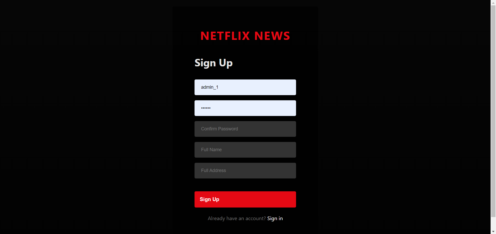

### 5.2 Dashboard and Navigation

**Main Dashboard**
- URL: `/index.html`

- Features: Statistics overview, ECharts visualizations, top-rated series, recent feedback

  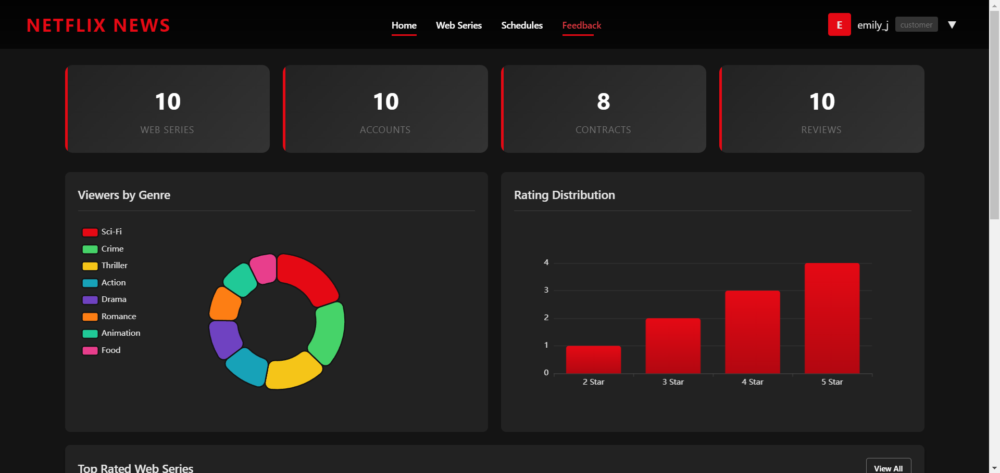

**Navigation Menu (Employee View)**

- Shows additional menu items for employees: Production Houses, Producers, Contracts, Accounts

  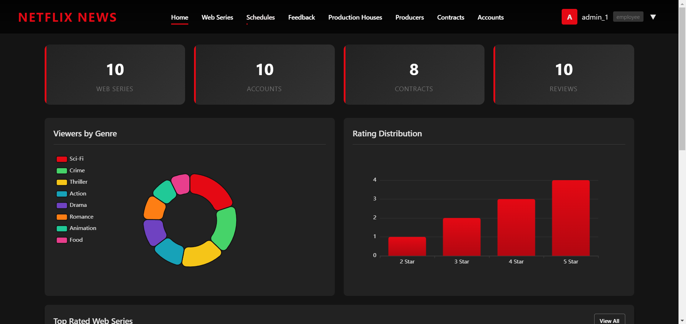

### 5.3 Content Management

**Web Series List**
- URL: `/web-series.html`

- Features: Search, filter by type, pagination, CRUD operations (employee only)

  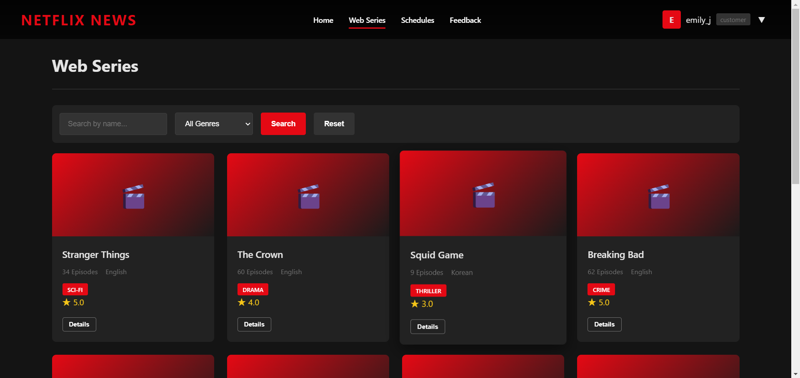

**Web Series Detail**
- URL: `/web-series-detail.html?id={id}`

- Features: Detailed view, feedback submission, rating display

  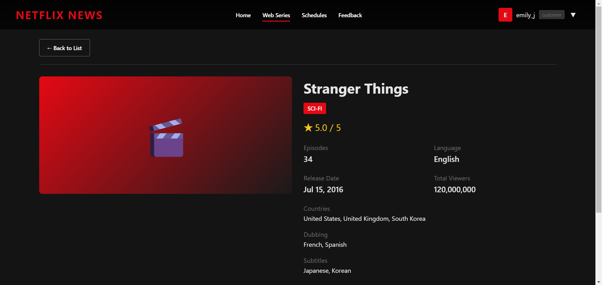

  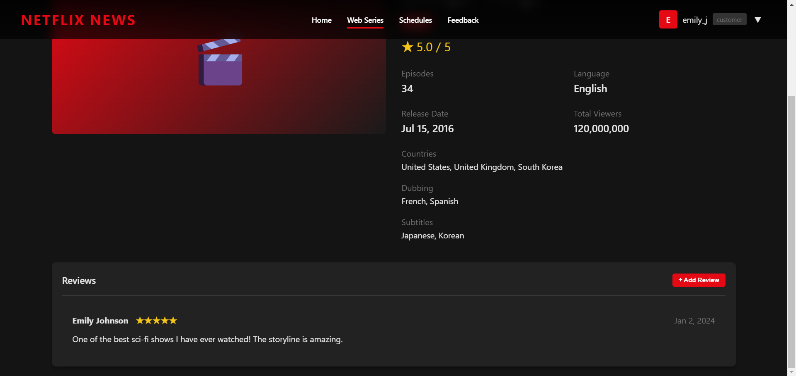

### 5.4 Schedule Management

**Schedules Page**

- URL: `/schedules.html`

- Features: Upcoming schedules, date filtering, add/edit/delete (employee only)

  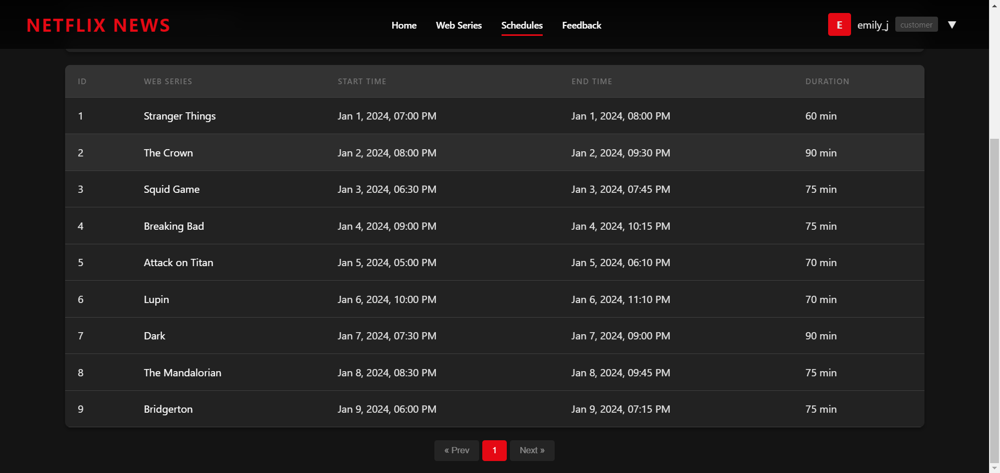

### 5.5 Feedback System

**Feedback Page**
- URL: `/feedback.html`

- Features: Rating distribution chart, feedback list, delete capability

  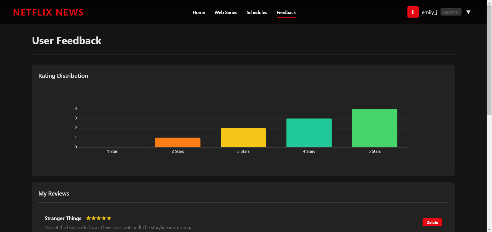

  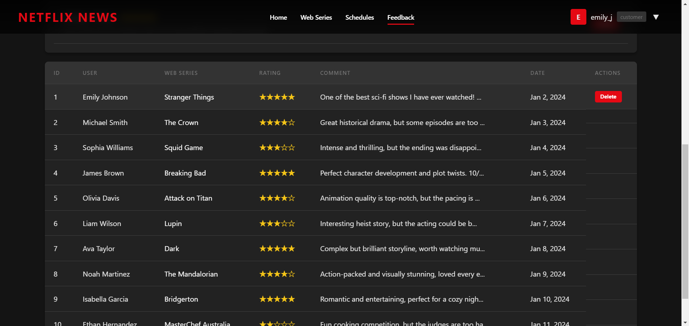

### 5.6 Employee-Only Pages

**Production Houses Management**
- URL: `/production-houses.html`

- Features: Company CRUD, search functionality

  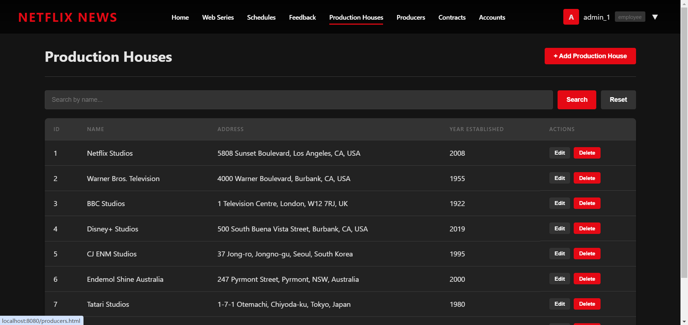

**Producers Management**
- URL: `/producers.html`

- Features: Producer CRUD, link to production houses

  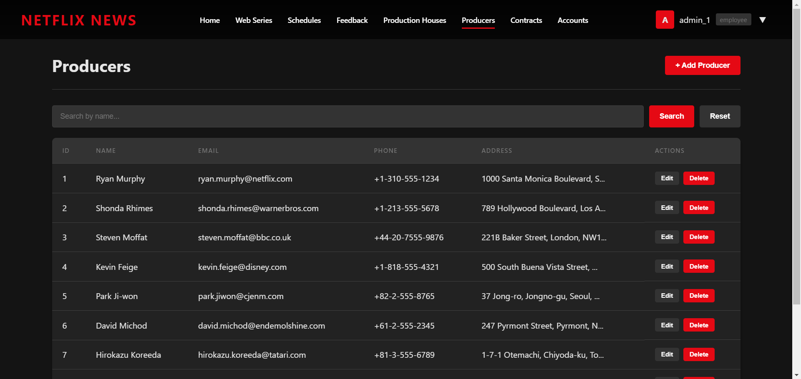

**Contracts Management**
- URL: `/contracts.html`

- Features: Contract CRUD, automatic end date calculation

  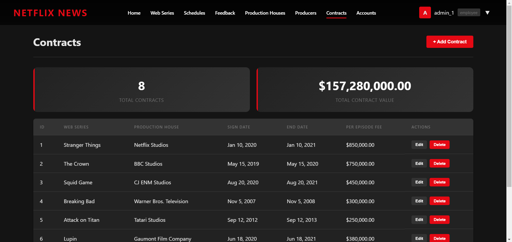

**Accounts Management**
- URL: `/accounts.html`

- Features: Customer account management, search

  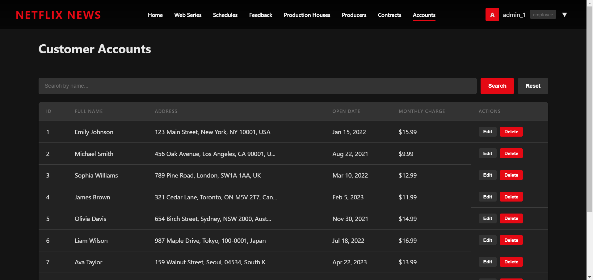

### 5.7 User Menu and Password Change

**User Dropdown Menu**
- Features: Change password option, logout

  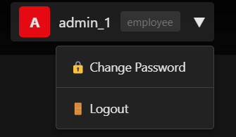

**Change Password Modal**
- Features: Current password verification, new password validation

  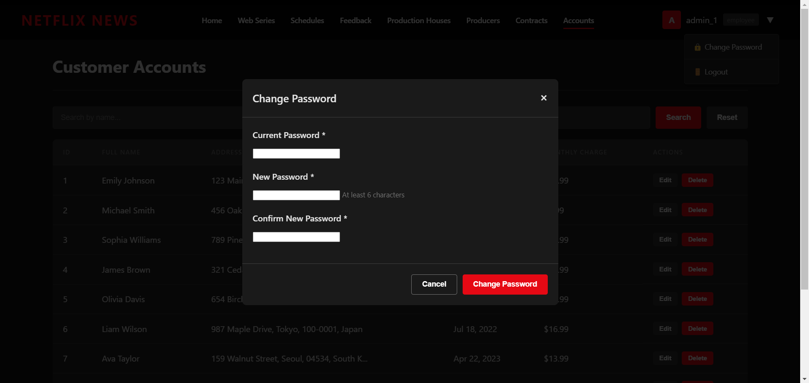

---

## 6. Security Features Implementation

### 6.1 Authentication & Authorization

| Feature | Implementation |
|---------|----------------|
| **JWT Authentication** | Stateless token-based authentication using JJWT library |
| **Token Expiration** | 24-hour validity with automatic renewal |
| **Password Encryption** | BCrypt hashing algorithm with salt |
| **Role-Based Access Control** | Customer vs Employee permission levels |

**JWT Token Structure:**
```
Header: { "alg": "HS512" }
Payload: { "sub": "userId", "role": "customer|employee", "iat": timestamp, "exp": timestamp }
Signature: HMACSHA512(header + payload, secretKey)
```

### 6.2 SQL Injection Prevention

| Technique | Implementation |
|-----------|----------------|
| **Prepared Statements** | MyBatis parameterized queries using `#{param}` syntax |
| **Input Validation** | JSR-303 Bean Validation annotations |
| **Type Safety** | Strong typing in Java prevents injection vectors |

**Example Safe Query (MyBatis):**
```java
@Select("SELECT * FROM jqy_user WHERE username = #{username}")
User findByUsername(@Param("username") String username);
```

### 6.3 XSS Prevention

| Technique | Implementation |
|-----------|----------------|
| **Output Encoding** | Frontend escapes user-generated content |
| **Content-Type Headers** | Proper MIME types prevent script execution |
| **Input Sanitization** | Server-side validation of all inputs |

### 6.4 CORS Configuration

```java
@Configuration
public class SecurityConfig {
    // CORS headers configured for allowed origins
    // Credentials support enabled for JWT tokens
}
```

### 6.5 API Security Endpoints

| Endpoint Pattern | Access Level |
|------------------|--------------|
| `/api/auth/**` | Public (login, register) |
| `/api/web-series/**` | Authenticated (read), Employee (write) |
| `/api/production-houses/**` | Employee only |
| `/api/producers/**` | Employee only |
| `/api/contracts/**` | Employee only |
| `/api/accounts/**` | Employee only |
| `/api/feedback/**` | Authenticated (own data), Employee (all) |

### 6.6 Transaction Management

```java
@Service
public class WebSeriesService {
    @Transactional
    public void createWebSeries(WebSeriesDTO dto) {
        // Atomic operations with rollback on failure
    }
}
```

**Deadlock Prevention:**
- Consistent lock ordering in multi-table operations
- Short transaction scopes to minimize lock duration
- Optimistic locking where applicable

---

## 7. Lessons Learned

### 7.1 Project Reflection

This project provided valuable hands-on experience in full-stack web development, from database design to frontend implementation. The integration of multiple technologies (Spring Boot, MyBatis, MySQL, JavaScript) required careful coordination and understanding of each layer's responsibilities.

### 7.2 Knowledge Gained

| Area | Learning |
|------|----------|
| **Database Design** | Normalization principles, relationship modeling, index optimization |
| **Backend Development** | RESTful API design, Spring Security, transaction management |
| **Frontend Development** | Modern JavaScript practices, responsive CSS, API integration |
| **Security** | JWT implementation, SQL injection prevention, password hashing |
| **DevOps** | Maven build process, configuration management |

### 7.3 Successes

1. **Clean Architecture**: Achieved clear separation of concerns across presentation, business, and data layers
2. **Security Implementation**: Successfully implemented multiple security measures including JWT, BCrypt, and prepared statements
3. **User Experience**: Created an intuitive, Netflix-inspired interface with responsive design
4. **Data Visualization**: Integrated ECharts for meaningful statistical displays
5. **Role-Based Features**: Effectively differentiated customer and employee functionalities

### 7.4 Challenges and Shortcomings

| Challenge | Resolution/Learning |
|-----------|---------------------|
| **MyBatis Column Mapping** | Required explicit `@Results` annotations for JOIN queries |
| **JWT Token Management** | Implemented proper token refresh and expiration handling |
| **Frontend State Management** | Managed complexity through modular JavaScript organization |
| **Cross-Browser Compatibility** | Tested and adjusted CSS for consistent appearance |

### 7.5 Constraints Faced

1. **Time Management**: Balancing feature development with testing and documentation required prioritization
2. **Technology Learning Curve**: Integrating unfamiliar technologies (e.g., ECharts) required additional research time
3. **Scope Control**: Had to carefully limit features to essential functionality while maintaining completeness
4. **Testing Coverage**: Limited time for comprehensive unit and integration testing

### 7.6 Future Improvements

If more time were available, the following enhancements would be valuable:

1. **Unit Testing**: Add JUnit tests for service layer and API endpoints
2. **Caching**: Implement Redis caching for frequently accessed data
3. **File Upload**: Add support for web series poster images
4. **Advanced Search**: Implement full-text search capabilities
5. **Notifications**: Add email notifications for account activities
6. **Mobile App**: Develop native mobile applications using the existing API

---

## 8. SQL Analysis

### 8.1 Multi-table Join Query (At Least 3 Tables)

##### Business Question

Count the rating of users for web series produced in different countries, including user full name, web series name, production country, rating, and feedback date. This is used to analyze user satisfaction with web series from different regions.

```mysql
SELECT 
    a.full_name AS user_full_name,
    ws.name AS web_series_name,
    c.country_name AS production_country,
    f.rating AS rating_score,
    DATE_FORMAT(f.feedback_date, '%Y-%m-%d') AS feedback_date
FROM 
    jqy_feedback f
JOIN jqy_account a ON f.account_id = a.account_id
JOIN jqy_web_series ws ON f.web_series_id = ws.web_series_id
JOIN jqy_web_series_country wsc ON ws.web_series_id = wsc.web_series_id
JOIN jqy_country c ON wsc.country_id = c.country_id
ORDER BY 
    f.rating DESC, f.feedback_date DESC;
```

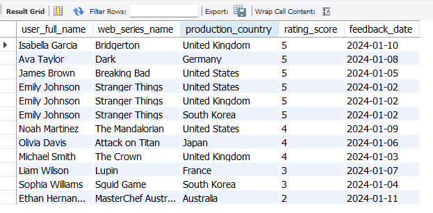

#### 8.2 Multi-row Subquery

##### Business Question

Query all production houses that have produced "Sci-Fi" type web series, and display the production house name, year established, and the number of Sci-Fi web series produced. This helps identify core production partners for Sci-Fi content.

```mysql
SELECT 
    ph.name AS production_house_name,
    ph.year_established AS established_year,
    COUNT(DISTINCT ws.web_series_id) AS sci_fi_series_count
FROM 
    jqy_production_house ph
JOIN jqy_contract c ON ph.production_house_id = c.production_house_id
JOIN jqy_web_series ws ON c.web_series_id = ws.web_series_id AND ws.type = 'Sci-Fi'
GROUP BY 
    ph.production_house_id,
    ph.name, 
    ph.year_established
ORDER BY 
    sci_fi_series_count DESC;
```

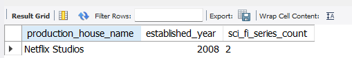

#### 8.3 Correlated Subquery

##### Business Question

Query users who have given a higher rating than the average rating of the web series they reviewed, including user name, web series name, user rating, and average rating of the web series. This is used to identify high-satisfaction users for specific content.

```mysql
SELECT 
    a.full_name AS user_name,
    ws.name AS web_series_name,
    f.rating AS user_rating,
    (SELECT AVG(rating) FROM jqy_feedback WHERE web_series_id = f.web_series_id) AS avg_series_rating
FROM 
    jqy_feedback f
JOIN jqy_account a ON f.account_id = a.account_id
JOIN jqy_web_series ws ON f.web_series_id = ws.web_series_id
WHERE 
    f.rating > (SELECT AVG(rating) FROM jqy_feedback WHERE web_series_id = f.web_series_id)
ORDER BY 
    avg_series_rating DESC, user_rating DESC;
```

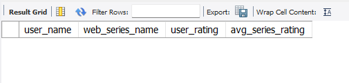

#### 8.4 Query with SET Operators

##### Business Question

Combine the list of web series with technical interruptions and web series with total viewers exceeding 100 million, and display the web series name, type, total viewers, and technical interruption status. This helps identify high-impact content with operational issues.

```mysql
SELECT 
    name AS web_series_name,
    type AS series_type,
    total_viewers,
    technical_interruption
FROM 
    jqy_web_series
WHERE 
    technical_interruption = 'Yes'
UNION
SELECT 
    name AS web_series_name,
    type AS series_type,
    total_viewers,
    technical_interruption
FROM 
    jqy_web_series
WHERE 
    total_viewers > 100000000
ORDER BY 
    total_viewers DESC;
```

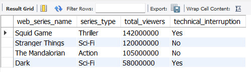

#### 8.5 Query with CTE (WITH Clause)

##### Business Question

Calculate the total contract fee (per episode fee × number of episodes) for each production house, and rank production houses by total contract fee. This is used to analyze the cost structure of cooperation with production houses.

```mysql
WITH contract_fee_summary AS (
    SELECT 
        ph.production_house_id,
        ph.name AS production_house_name,
        c.web_series_id,
        c.per_episode_fee,
        ws.number_of_episodes,
        (c.per_episode_fee * ws.number_of_episodes) AS total_contract_fee
    FROM 
        jqy_contract c
    JOIN jqy_production_house ph ON c.production_house_id = ph.production_house_id
    JOIN jqy_web_series ws ON c.web_series_id = ws.web_series_id
)
SELECT 
    production_house_name,
    SUM(total_contract_fee) AS total_fee_amount,
    RANK() OVER (ORDER BY SUM(total_contract_fee) DESC) AS fee_rank
FROM 
    contract_fee_summary
GROUP BY 
    production_house_name
ORDER BY 
    fee_rank;
```

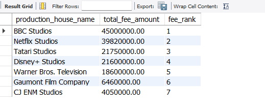

#### 8.6 TOP-N Query

##### Business Question

Query the top 5 web series with the highest average user ratings, including web series name, type, total viewers, and average rating. This helps identify the most popular content for content recommendation and operation.

```mysql
SELECT 
    ws.name AS web_series_name,
    ws.type AS series_type,
    ws.total_viewers,
    ROUND(AVG(f.rating), 2) AS avg_rating
FROM 
    jqy_web_series ws
JOIN jqy_feedback f ON ws.web_series_id = f.web_series_id
GROUP BY 
    ws.name, ws.type, ws.total_viewers
ORDER BY 
    avg_rating DESC
LIMIT 5;
```

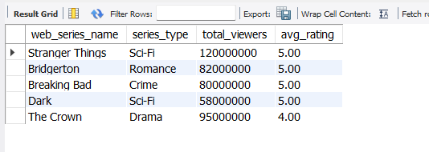

---

## Appendix A: Project Structure

```
netflix-news-system/
├── src/main/java/netflix/news/system/
│   ├── NetflixNewsSystemApplication.java
│   ├── config/
│   │   └── WebConfig.java
│   ├── controller/
│   │   ├── AuthController.java
│   │   ├── WebSeriesController.java
│   │   ├── CountryController.java
│   │   ├── ProductionHouseController.java
│   │   ├── ProducerController.java
│   │   ├── ContractController.java
│   │   ├── ScheduleController.java
│   │   ├── FeedbackController.java
│   │   ├── AccountController.java
│   │   ├── UserController.java
│   │   └── StatisticsController.java
│   ├── service/
│   │   └── [10 service classes]
│   ├── mapper/
│   │   └── [12 MyBatis mapper interfaces]
│   ├── entity/
│   │   └── [9 entity classes]
│   ├── dto/
│   │   └── [9 DTO classes]
│   ├── security/
│   │   ├── JwtTokenProvider.java
│   │   ├── JwtAuthenticationFilter.java
│   │   ├── SecurityConfig.java
│   │   └── UserPrincipal.java
│   └── exception/
│       └── GlobalExceptionHandler.java
├── src/main/resources/
│   ├── application.yml
│   └── static/
│       ├── css/style.css
│       ├── js/
│       │   ├── api.js
│       │   └── common.js
|       |   └── echarts.min.js
│       └── [10 HTML pages]
└── pom.xml
```

---

## Appendix B: API Endpoints Reference

| Method | Endpoint | Description | Access |
|--------|----------|-------------|--------|
| POST | /api/auth/register | Register new customer | Public |
| POST | /api/auth/login | User login | Public |
| GET | /api/auth/me | Get current user | Auth |
| POST | /api/auth/change-password | Change password | Auth |
| GET | /api/web-series | List all series | Auth |
| GET | /api/web-series/{id} | Get series details | Auth |
| POST | /api/web-series | Create series | Employee |
| PUT | /api/web-series/{id} | Update series | Employee |
| DELETE | /api/web-series/{id} | Delete series | Employee |
| GET | /api/statistics/dashboard | Dashboard stats | Auth |
| GET | /api/statistics/viewers-by-type | Chart data | Auth |
| GET | /api/statistics/rating-distribution | Rating stats | Auth |

---

**Document Prepared By:** [Your Name]  
**Date:** December 2025  
**Course:** [Course Name]  
**Institution:** [University Name]
